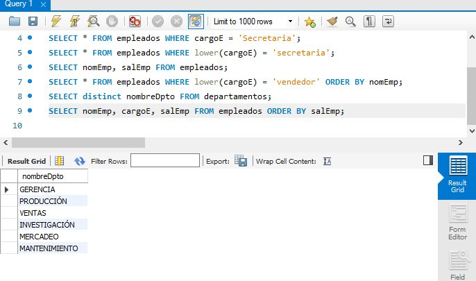
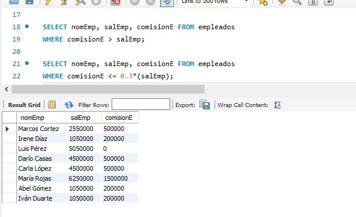

# EJERCICIOS CON SQL

Una recopilación de ejercicios con SQL.

# STACK

* MySQL Server
* MySQL Workbench

# QUERYS

* CONSULTAS 01 

1. Obtener los datos completos de los empleados.
   
   SELECT * FROM empleados;

2. Obtener los datos completos de los departamentos
    
    SELECT * FROM departamentos;

3. Obtener los datos de los empleados con cargo 'Secretaria'.
   
   SELECT * FROM empleados WHERE cargoE = 'Secretaria';

    otra rpta puede ser así: SELECT * FROM empleados WHERE lower(cargoE) = 'secretaria'; 

4. Obtener el nombre y salario de los empleados.
   
   SELECT nomEmp, salEmp FROM empleados; 

5. Obtener los datos de los empleados vendedores, ordenado por nombre.
   
   SELECT * FROM empleados WHERE lower(cargoE) = 'vendedor' ORDER BY nomEmp; 

6. Listar el nombre de los departamentos
   
   SELECT distinct nombreDpto FROM departamentos; 

7. Obtener el nombre y cargo de todos los empleados, ordenado por salario
   
   SELECT nomEmp, cargoE, salEmp FROM empleados ORDER BY salEmp;

* CONSULTAS 02

8. Listar los salarios y comisiones de los empleados del departamento 2000, ordenado por comisión

    SELECT nomEmp, salEmp, comisionE, codDepto FROM empleados WHERE codDepto = 2000 ORDER BY comisionE;

9. Listar todas las comisiones

   SELECT DISTINCT comisionE FROM empleados;

10. Obtener el valor total a pagar que resulta de sumar a los empleados del departamento 3000 una
bonificación de 500.000, en orden alfabético del empleado.

    SELECT nomEmp, salEmp, (salEmp + 500000) AS 'Pago Estimado' 
    FROM empleados WHERE codDepto = 3000 ORDER BY nomEmp;

11. Obtener la lista de los empleados que ganan una comisión superior a su sueldo.

    SELECT nomEmp, salEmp, comisionE FROM empleados 
    WHERE comisionE > salEmp;

12. Listar los empleados cuya comisión es menor o igual que el 30% de su sueldo.

    SELECT nomEmp AS Empleados , salEmp AS Salarios , comisionE AS '30% - Comisiones' FROM empleados
    WHERE comisionE <= 0.3*(salEmp);
	
## Screenshot

* CONSULTAS 01

* CONSULTAS 02

